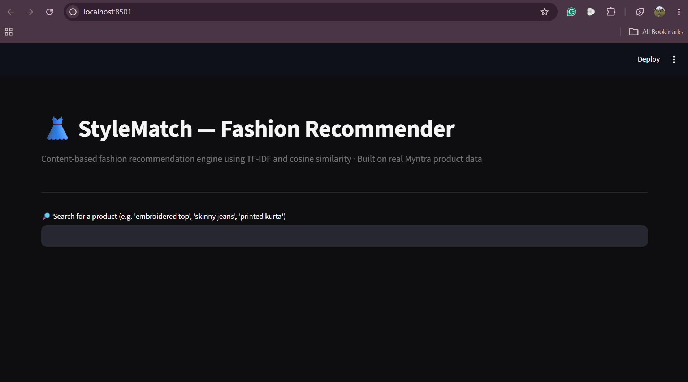
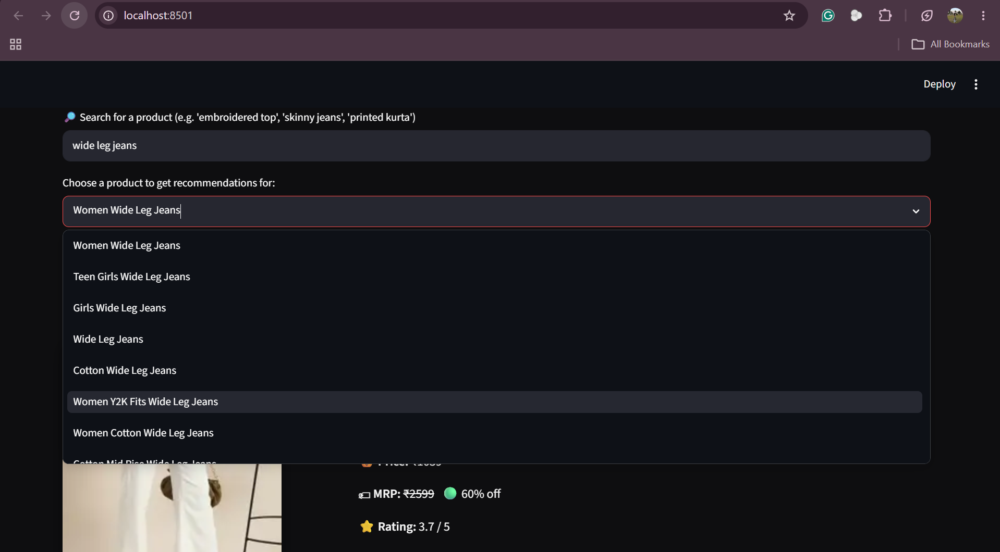
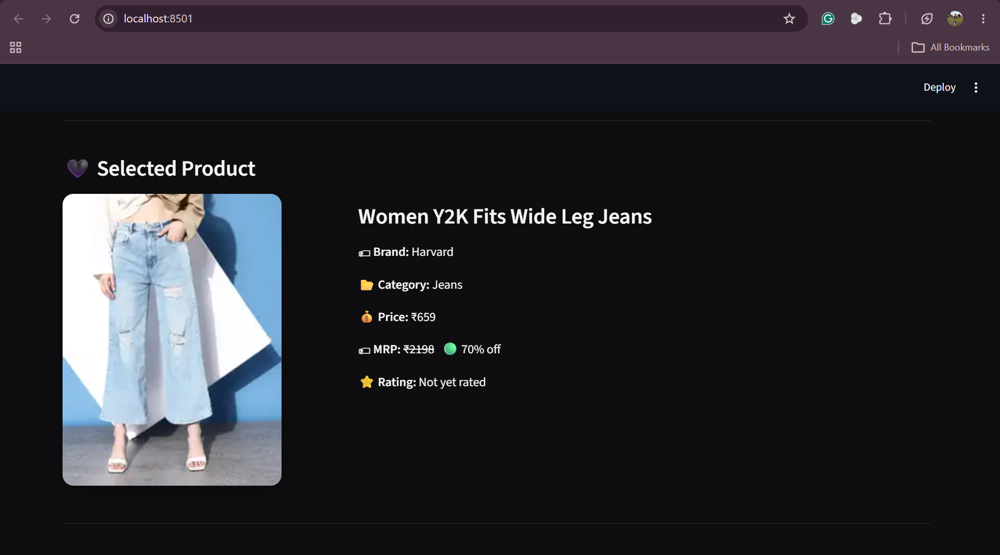

# 👗 StyleMatch — Fashion Recommendation Engine

A content-based fashion product recommendation system built using **NLP (TF-IDF)** and **cosine similarity**, trained on real Myntra product data.

Given a fashion product, StyleMatch identifies visually and textually similar alternatives using NLP-based content similarity and presents them through an interactive Streamlit web application.

---

## 📊 Dataset

- **Source:** Kaggle – Myntra Fashion Clothing Products Catalog
- **Original dataset:** 1,060,213 product records
- **After filtering:** 131,599 products
- **Final dataset:** 76,571 unique products after duplicate removal

The recommendation engine is built on four fashion categories:

- Tops
- Dresses
- Kurtas
- Jeans

---

## 📸 Preview

### Home



### Search



### Selected Product



### Recommendations


> Built as part of the Myntra WeForShe application process to demonstrate an NLP-based recommendation system.

---

## 🛠 Tech Stack

- **Python** — core language
- **pandas** — data loading, cleaning, and preprocessing
- **scikit-learn** — TF-IDF vectorization and cosine similarity
- **Streamlit** — interactive web frontend
- **Kaggle Dataset** — real Myntra fashion product data (~76,000 products after cleaning)

---

## 📁 Project Structure

```text
stylematch/
│
├── app.py                         # Streamlit web application
├── recommender.py                 # Recommendation engine
├── requirements.txt               # Project dependencies
├── README.md
├── .gitignore
│
├── assets/
│   └── screenshots/
│       ├── home.png
│       ├── search.png
│       ├── product.png
│       └── recommendations.png
│
├── data/
│   ├── myntra_products_raw.csv    # Original dataset (not included in GitHub)
│   ├── fashion_products.csv       # Filtered dataset
│   ├── prepared_products.csv      # Final cleaned dataset
│   └── README.md
│
└── src/
    ├── explore.py                 # Dataset exploration
    ├── filter_data.py             # Category filtering
    └── prepare_text.py            # Data preprocessing
```

---

## ⚙️ How It Works

1. **Data Preprocessing** — filtered 1M+ raw Myntra products to 4 focused categories (kurtas, dresses, tops, jeans). Removed duplicate product URLs, reducing the dataset from 86,802 to 76,571 unique products using `drop_duplicates(subset="purl")`.

2. **Feature Engineering** — Created a combined textual feature by concatenating product `name` and `category` into a single `combined_text`. Seller information was intentionally excluded after observing it biased recommendations toward products from the same brand.

3. **TF-IDF Vectorization** — `TfidfVectorizer` converts product text into numeric vectors, weighting rare descriptive words higher and ignoring common English stop words.

4. **Cosine Similarity** — instead of pre-computing an 76k×76k similarity matrix (which would require 20+ GB RAM), similarity is computed **on-demand** for the selected product only — a deliberate memory optimization.

5. **Streamlit UI** — search, select a product, and browse recommendations with images, prices, ratings, and direct Myntra links.

---

## 🚀 Running Locally

### 1. Clone the repository

```bash
git clone https://github.com/khushisahuu/stylematch.git
cd stylematch
```

### 2. Install dependencies

```bash
pip install -r requirements.txt
```

### 3. Download the dataset

Download the **Fashion Clothing Products Catalog** dataset from Kaggle:

https://www.kaggle.com/datasets/shivamb/fashion-clothing-products-catalog

Place the downloaded CSV file in the `data/` folder and rename it to:

```text
data/
└── myntra_products_raw.csv
```

### 4. Prepare the dataset

Run the preprocessing pipeline:

```bash
python src/filter_data.py
python src/prepare_text.py
```

This generates:

```text
data/
├── fashion_products.csv
└── prepared_products.csv
```

### 5. Launch the application

```bash
streamlit run app.py
```

---

## 📌 Key Engineering Decisions

| Decision | Reason |
|---|---|
| Filtered to 4 categories | Processing 1M+ rows was impractical; focused scope gives cleaner recommendations |
| Excluded `seller` from features | Including brand name biased results toward same-seller products |
| Deduplicated on `purl` | Some products had different IDs but identical URLs — genuine duplicates |
| On-demand cosine similarity | Pre-computing 86k×86k matrix would crash a standard laptop (60GB+ RAM) |
| TF-IDF over embeddings | Interpretable, fast, and appropriate for this scale without GPU |

---

## ✨ Features

- Search products by name
- Content-based fashion recommendations
- Interactive Streamlit interface
- Product images, prices and ratings
- Direct links to Myntra products
- Duplicate product removal
- Memory-optimized recommendation generation

---

## 📈 Future Improvements

- Integrate semantic embeddings using Sentence Transformers.
- Add personalized recommendations based on user preferences.
- Deploy the recommendation engine with a FastAPI backend.
- Expand the dataset to include additional fashion categories.
- Improve recommendation quality using hybrid recommendation techniques.

---

## 👩‍💻 Author

**Khushi Sahu**

B.Tech Computer Science Engineering (Artificial Intelligence & Machine Learning)

Manipal University Jaipur

- LinkedIn: https://www.linkedin.com/in/khushi-sahu-383760282/
- GitHub: https://github.com/khushisahuu

---